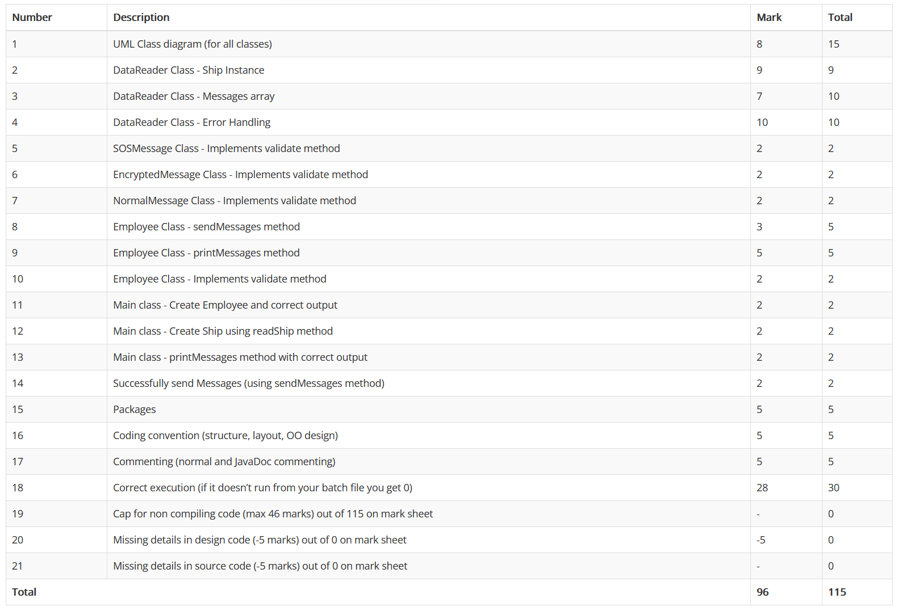
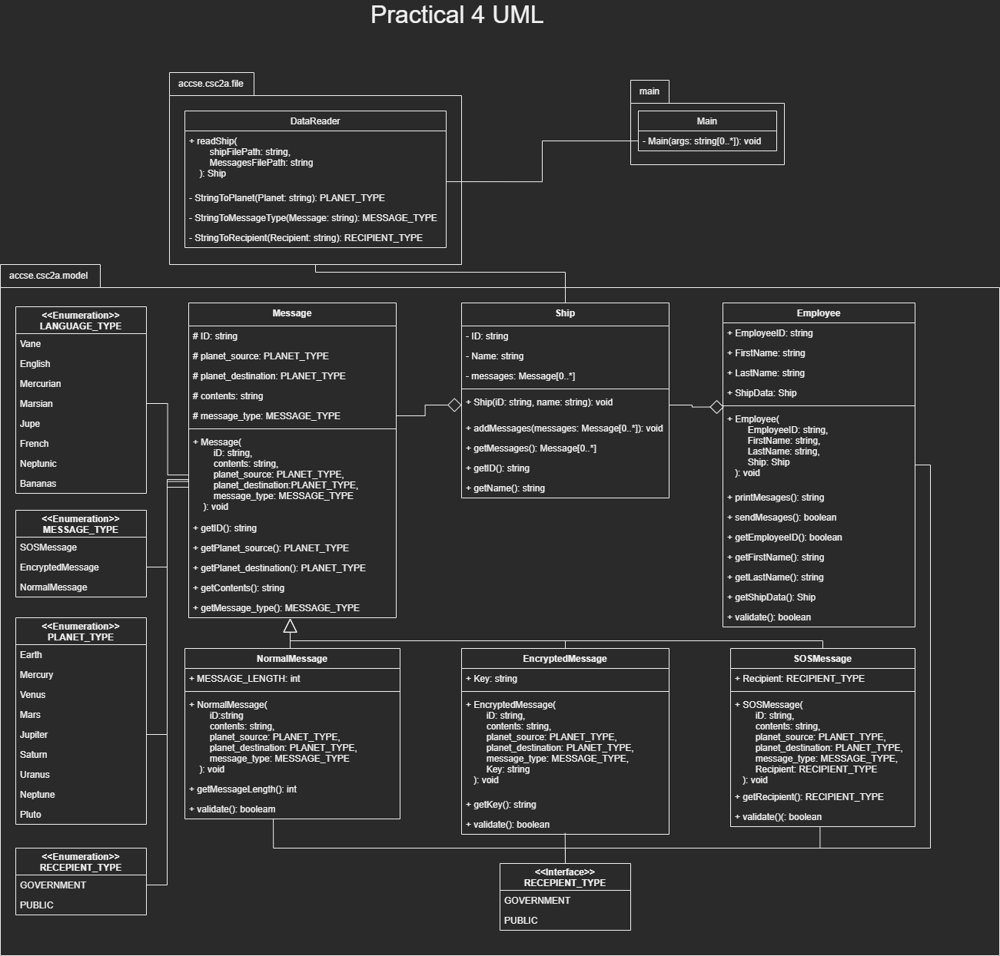
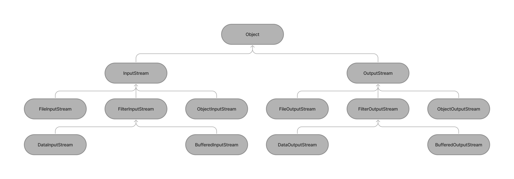

# UJ CSC2A Practical 4

## Table Of Content

- [Additional Information](#additional-information)
- [Marks](#marks)
- [UML](#uml)
- [The JAR file](#the-jar-file)
    * [Contents of JAR File](#contents-of-jar-file)
    * [IntelliJ](#intellij)
    * [Build batch file](#build-batch-file)
- [Object-oriented Concepts & Interface implementation](#object-oriented-concepts---interface-implementation)
    * [Inheritance](#inheritance)
    * [Polymorphism](#polymorphism)
- [Binary IO](#binary-io)
    * [Short description](#short-description)
        + [Filtered IO Classes](#filtered-io-classes)
        + [Filtered IO](#filtered-io)
        + [Object IO](#object-io)
        + [ARM (Automatic Resource Management)](#arm--automatic-resource-management-)
    * [Reading Ship from Binary file](#reading-ship-from-binary-file)
- [Cool things](#cool-things)

## Additional Information

This practical adds on to the [previous practical (Prac03)](https://github.com/ThaBeanBoy/UJ_CSC2A_P03). This time we 
have been provided with a JAR file

## Marks



## UML
I made a mistake when making the UML, I was supposed to use the icon for composition, instead I used the aggregation icon.



## The JAR file

### Contents of JAR File

The [JAR File](./lib/MWSCB.jar) contained a few things, I'll mainly go through the classes, enums & interface in the JAR
file.

- Ship class
- Message class
- IValidation interface
- LANGUAGE_TYPE Interface
- MESSAGE_TYPE Interface
- PLANET_TYPE Interface
- RECIPIENT_TYPE Interface

### IntelliJ

In order to use the JAR in IntelliJ IDE, I had to add it to the project structure. you can press & hold the keys 
```ctrl + alt + shift + s```. from there, you can add the JAR file to the project.

### Build batch file

In the [batch file](./docs/BUILD_&_RUN.bat) provided to us by the lecturer, when it compiles the code, it will automatically
look for any JAR files in the lib directory.

## Object-oriented Concepts & Interface implementation

### Inheritance
One of the main things Our lecturer wanted us to grasp in this project was making a class inherit from a parent class.
In the [JAR file](./lib/MWSCB.jar) provided to us, a ```Message``` class was provided to us with all the relavent properties
& methods. I honestly woud've preffered if he let us build upon [last week's practical](https://github.com/ThaBeanBoy/UJ_CSC2A_P03).
I think this would have given us the opportunity to play around with the ```public```, ```private``` & ```protected```. But
I guess that's simple to understand anyway.

Each messages class & ```Employee``` class implement the ```IValidation``` interface.

**NB: I'll be demonstrating inheritance using one of the child class (NormalMessage Class)**

```java
package acsse.csc2a.model;

import acsse.csc2a.model.IValidation;
import acsse.csc2a.model.Message;

public class NormalMessage extends Message implements IValidation {
    private final int MESSAGE_LENGTH;

    public NormalMessage(
            String iD,
            String contents,
            PLANET_TYPE planet_source,
            PLANET_TYPE planet_destination,
            MESSAGE_TYPE message_type,
            int MessageLength
    ){
        super(iD, contents, planet_source, planet_destination, message_type);
        this.MESSAGE_LENGTH = MessageLength;
    }

    public int getMessageLength(){
        return this.MESSAGE_LENGTH;
    }

    //Implementing Validation Interface
    @Override
    public boolean validate() {
        return (this.contents.length() <= this.MESSAGE_LENGTH);
    }
}
```

obviously we had to ```extend``` the Message in order to inherit, but there was 1 thing I actually learned here. Initially, 
the EncryptedMessage constructor would throw an Err exception. If the key length was less than 10 characters, an exception
would be thrown. But the IDE was complaining and said that the bas class' constructor should be called first.

### Polymorphism

Now bear with me here, I know having a fixed length array of 1 seems nonsensical (We could easily declare a variable of 
type ```Message```). The reason why is because, the ```addMessages``` method from the ```Ship``` object only accepts an 
array of ```Message```, and in the loop, I wanted to add 1 message at a time.

Where polymorphism comes into play is where I store different types of messages 
([```EncryptedMessage```](./src/acsse/csc2a/model/EncryptedMessage.java),
[```NormalMessage```](./src/acsse/csc2a/model/NormalMessage.java) 
& [```SOSMessage```](./src/acsse/csc2a/model/SOSMessage.java)). If I'm not mistaken, this is upcasting.

```java
public class DataReader{
    // Rest of DataReader Class
    
    public static Ship readShip(String shipFilePath, String MessagesFilePath){
        // Automatic Resource Management
        
        Message[] Messages = new Message[1];
        
        Messages = appendArray(Messages, switch (MessageType){
                                case SOSMessage -> new SOSMessage(
                                        Message_ID,
                                        Content,
                                        SourcePlent,
                                        DestinationPalent,
                                        MessageType,
                                        DataReader.StringToRecipient(AdditionalProperty)
                                        );
        
                                case EncryptedMessage -> new EncryptedMessage(
                                        Message_ID,
                                        Content,
                                        SourcePlent,
                                        DestinationPalent,
                                        MessageType,
                                        AdditionalProperty
                                );
        
                                case NormalMessage ->  new NormalMessage(
                                        Message_ID,
                                        Content,
                                        SourcePlent,
                                        DestinationPalent,
                                        MessageType
                                );
                            });

        //Saving message
        Ship.addMessages(Messages);
        
    }
    
    // Rest of DataReader Class
}
```

I also used polymorphism for display purposes. The loop loops through a ```Message``` array, meaning each a Message was 
a single ```Message``` instance. n the print messages, I wanted to print each message and all it's properties regardless
of the ```Message_Type``` & print out properties unique to each sub message class. In the switch statement, I would 
downcast the Message into the appropriate Type, & then extract the information using accessor methods. 

```java
public class Employee{
    public String printMessages(){
        StringBuilder finalPrint = new StringBuilder();

        finalPrint.append(String.format("%s %s Messages \n\n", this.getEmployeeID(), this.getLastName()));

        for(Message Message : this.ShipData.getMessages()) {
            //Getting Message properties
            finalPrint.append(String.format("""
                            ID: %s | %s -> %s | %s
                            Message Type:  %s | %s
                            """,
                    // Message properties
                    Message.getID(),
                    Message.getPlanet_source(),
                    Message.getPlanet_destination(),
                    Message.getContents(),
                    Message.getMessage_type(),

                    //Polymorphism
                    switch(Message.getMessage_type()){
                        case SOSMessage -> {
                            SOSMessage SOS = (SOSMessage) Message;
                            yield String.format("Recipient: %s", SOS.getRecipient());
                        }

                        case EncryptedMessage -> {
                            EncryptedMessage EM = (EncryptedMessage) Message;
                            yield String.format("Key: %s", EM.getKey());
                        }

                        case NormalMessage -> {
                            NormalMessage NM = (NormalMessage) Message;
                            yield String.format("Message length: %d", NM.getMessageLength());
                        }
                    }
            ));
        }

        return finalPrint.toString();
    }
}
```

## Binary IO

### Short description

Binary IO is a way for programmers to read/write to files stored on the disk at byte level. You can also utilise Text IO
to automatically encode & decode Binary, but Binary IO doesn't require any sort of conversion, since the files are saved
as bytes. This makes Binary IO more efficient. 

#### Filtered IO Classes



When working with Binary files, it's recommended to use buffered streams (```BufferedInputStream```/ ```BufferedOutputStream```).
Reason being is that  buffer streams are stored RAM instead of Memory, therefore working with buffer is faster than
trying to access files from disk.

#### Filtered IO

Using Filtered IO, you can extract primitive data types from a file. In order for us to do this, we need a filtered stream
instance (```FilterInputStream``` / ```FilterOutputStream```),

#### Object IO

I think Object IO falls out the scope of this practical.

#### ARM (Automatic Resource Management)

Just like in the [last practical](https://github.com/ThaBeanBoy/UJ_CSC2A_P03), we can use ARM to read & write Binary files.

### Reading Ship from Binary file

## Cool things

```java
public class Employee{
    public String printMessages(){
        StringBuilder finalPrint = new StringBuilder();

        finalPrint.append(String.format("%s %s Messages \n\n", this.getEmployeeID(), this.getLastName()));

        for(Message Message : this.ShipData.getMessages()) {
            //Getting Message properties
            finalPrint.append(String.format("""
                            ID: %s | %s -> %s | %s
                            Message Type:  %s | %s
                            """,
                    // Message properties
                    Message.getID(),
                    Message.getPlanet_source(),
                    Message.getPlanet_destination(),
                    Message.getContents(),
                    Message.getMessage_type(),

                    //Child class properties
                    switch(Message.getMessage_type()){
                        case SOSMessage -> {
                            SOSMessage SOS = (SOSMessage) Message;
                            yield String.format("Recipient: %s", SOS.getRecipient());
                        }

                        case EncryptedMessage -> {
                            EncryptedMessage EM = (EncryptedMessage) Message;
                            yield String.format("Key: %s", EM.getKey());
                        }

                        case NormalMessage -> {
                            NormalMessage NM = (NormalMessage) Message;
                            yield String.format("Message length: %d", NM.getMessageLength());
                        }
                    }
            ));
        }

        return finalPrint.toString();
    }
}
```